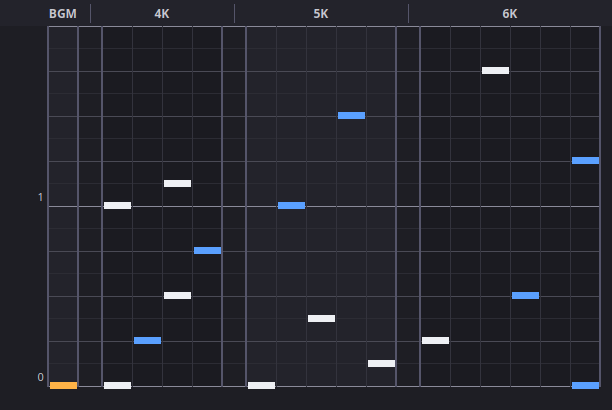

# SlimBMS

A slim, **keysound-less BMS chart editor** for **4K / 5K / 6K**.

SlimBMS is a deliberately small alternative to full editors like uBMSC. It does
one thing: let you place notes for the 4-key, 5-key and 6-key versions of a song
**side by side** so you can compare them at a glance, over a single background
music track — no per-note keysounds to manage.



## Concept

- **Three charts, one screen.** The 4K, 5K and 6K lanes are shown next to each
  other. Notes flow bottom-to-top (measure 0 at the bottom).
- **No keysounds.** The song is a single audio file (`.wav` / `.ogg` / …) laid
  down on the **BGM lane**; you only place its start timing plus the notes.
- **Save per key mode.** Pick `4K` / `5K` / `6K` in the toolbar and export that
  chart as a standard `.bms` file. Metadata and BGM are shared across all three.
- **Never lose work.** The native `.slbms` project file keeps all three charts
  together so an editing session round-trips losslessly.

## Files

| Format    | Contents                                             | Use                     |
|-----------|------------------------------------------------------|-------------------------|
| `.slbms`  | All three charts + shared metadata (JSON)            | Save / continue editing |
| `.bms`    | One selected key mode, standard BMS                  | Deliverable for a game  |

## Editing

- **Left click** a lane cell to place a note; click it again (or **right click**)
  to remove it.
- **Snap** (toolbar): choose the grid resolution (1/4 … 1/32, plus triplets).
- **Zoom** (toolbar `−` / `＋`): change vertical spacing.
- **곡 → 곡 정보 편집**: title, artist, genre, BPM, measure count.
- **곡 → BGM 오디오 선택**: pick the background audio file. Keep that file next
  to the exported `.bms` so the game can find it.

### Lane → BMS channel mapping

Keysound-less, so the channel numbers only matter when a chart is opened in
another BMS player. Defined in `slimbms/model.py` (`KEY_CHANNELS`):

| Key mode | Channels               |
|----------|------------------------|
| 4K       | 11 12 13 14            |
| 5K       | 11 12 13 14 15         |
| 6K       | 11 12 13 14 15 18      |

BGM objects use channel `01`.

## Running from source

```bash
python -m venv .venv
.venv/bin/pip install -r requirements.txt   # Windows: .venv\Scripts\pip
.venv/bin/python main.py                     # Windows: .venv\Scripts\python main.py
```

## Building the Windows `.exe`

Every push to `main` (and every `v*` tag) builds `SlimBMS.exe` via GitHub
Actions:

- **Download the latest build:** repo → **Actions** → newest *Build Windows exe*
  run → **Artifacts** → `SlimBMS-windows`.
- **Tagged release:** push a tag like `v0.1.0` and the exe is attached to the
  GitHub Release automatically.

To build locally on Windows:

```bat
pip install -r requirements.txt pyinstaller
pyinstaller --onefile --windowed --name SlimBMS --collect-submodules PySide6 main.py
```

The exe appears in `dist/SlimBMS.exe`.

## Tests

```bash
.venv/bin/python tests/test_bms_io.py     # data model + BMS/project I/O
QT_QPA_PLATFORM=offscreen .venv/bin/python tests/test_gui_smoke.py
```
